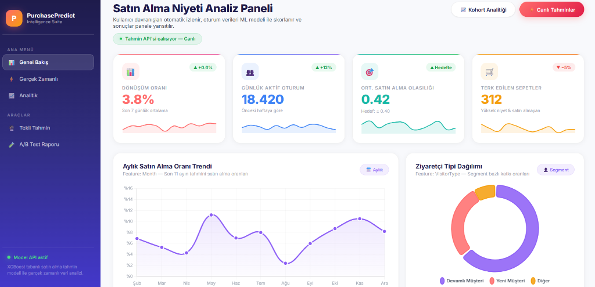
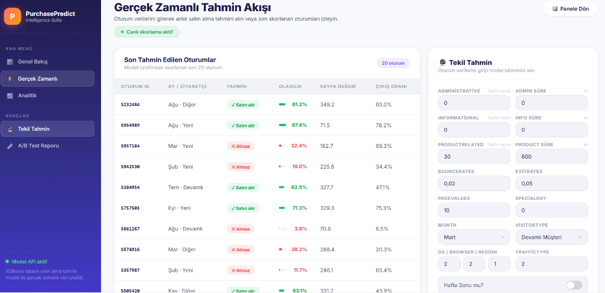

<p align="center">
  
  
  
  
</p>

<h1 align="center">🛒 PurchasePredict – Intelligence Suite</h1>

<p align="center">
  <strong>E-ticaret oturum verilerinden satın alma niyeti tahmini yapan,<br>makine öğrenmesi destekli gerçek zamanlı analiz paneli.</strong>
</p>

<p align="center">
  <a href="#-özellikler">Özellikler</a> •
  <a href="#-ekran-görüntüleri">Ekran Görüntüleri</a> •
  <a href="#-teknolojiler">Teknolojiler</a> •
  <a href="#-kurulum">Kurulum</a> •
  <a href="#-api-kullanımı">API Kullanımı</a> •
  <a href="#-proje-yapısı">Proje Yapısı</a> •
  <a href="#-deployment">Deployment</a>
</p>

---

## 📌 Proje Hakkında

**PurchasePredict**, [UCI Online Shoppers Purchasing Intention](https://archive.ics.uci.edu/ml/datasets/Online+Shoppers+Purchasing+Intention+Dataset) veri setine dayalı olarak eğitilmiş bir **XGBoost** sınıflandırıcı modeli kullanarak, e-ticaret sitesindeki ziyaretçilerin **satın alma yapıp yapmayacağını** tahmin eden uçtan uca bir makine öğrenmesi uygulamasıdır.

Kullanıcının oturum verileri (sayfa ziyaret sayısı, süre, bounce rate, exit rate, sayfa değeri, ziyaretçi tipi vb.) modele girdi olarak verilir ve gerçek zamanlı olarak **satın alma olasılığı** döndürülür.

---

## ✨ Özellikler

| Özellik | Açıklama |
|---------|----------|
| 📊 **Genel Bakış Paneli** | Dönüşüm oranı, günlük aktif oturum, ortalama satın alma olasılığı ve aylık trend grafikleri |
| ⚡ **Gerçek Zamanlı Tahmin** | Anlık oturum verisi girişi ile tekil satın alma tahmini ve olasılık skoru |
| 📈 **Analitik & Kohort Raporu** | Feature importance, aylık dönüşüm trendi, kohort ısı haritası, trafik kaynağı analizi |
| 🔮 **Tekil Tahmin Formu** | 17 farklı feature ile detaylı tahmin yapma imkanı |
| 🧪 **A/B Test Görünümü** | Bounce vs Exit oranı karşılaştırması, segment bazlı davranış metrikleri |
| 📱 **Responsive Tasarım** | Mobil ve masaüstü uyumlu, modern glassmorphism arayüz |
| 🟢 **REST API** | FastAPI tabanlı `/predict` endpoint'i ile programatik erişim |

---

## 📸 Ekran Görüntüleri

### 📊 Genel Bakış – Dashboard
> Dönüşüm oranı, aktif oturumlar, sparkline grafikler ve aylık trend analizi.



---

### ⚡ Gerçek Zamanlı Tahmin
> Son skorlanan oturumlar tablosu ve tekil tahmin formu ile anlık ML tahminleri.



---

### 📈 Analitik & Kohort Raporu
> Feature importance, en etkili değişkenler, segment kırılımları ve kohort analizi.


---

## 🛠 Teknolojiler

### Backend
- **[FastAPI](https://fastapi.tiangolo.com/)** – Yüksek performanslı async Python web framework
- **[XGBoost](https://xgboost.readthedocs.io/)** – Gradient boosting tabanlı ML sınıflandırıcı
- **[scikit-learn](https://scikit-learn.org/)** – Veri ön işleme ve feature scaling
- **[Pandas](https://pandas.pydata.org/)** – Veri manipülasyonu ve one-hot encoding
- **[Pydantic](https://docs.pydantic.dev/)** – Request/Response veri doğrulama

### Frontend
- **HTML5 / CSS3 / JavaScript** – Sıfırdan tasarlanmış modern UI
- **[Chart.js](https://www.chartjs.org/)** – İnteraktif grafikler ve veri görselleştirme
- **[Inter Font](https://fonts.google.com/specimen/Inter)** – Premium tipografi

### DevOps
- **[Uvicorn](https://www.uvicorn.org/)** – ASGI sunucu
- **[Render](https://render.com/)** – Cloud deployment

---

## 🚀 Kurulum

### Gereksinimler

- Python 3.10+
- pip

### Adımlar

```bash
# 1. Repoyu klonlayın
git clone https://github.com/ezgiorman/MLbased_Purchase_Intention_System.git
cd MLbased_Purchase_Intention_System

# 2. Sanal ortam oluşturun (opsiyonel ama önerilir)
python -m venv .venv
# Windows:
.venv\Scripts\activate
# macOS/Linux:
source .venv/bin/activate

# 3. Bağımlılıkları yükleyin
pip install -r requirements.txt

# 4. Uygulamayı çalıştırın
uvicorn app:app --reload
```

Tarayıcınızda **http://127.0.0.1:8000** adresine gidin. 🎉

---

## 📡 API Kullanımı

### `POST /predict`

Oturum verilerini göndererek satın alma tahmini alın.

**Request Body:**

```json
{
  "Administrative": 3,
  "Administrative_Duration": 80.0,
  "Informational": 2,
  "Informational_Duration": 45.0,
  "ProductRelated": 30,
  "ProductRelated_Duration": 600.0,
  "BounceRates": 0.02,
  "ExitRates": 0.05,
  "PageValues": 10.0,
  "SpecialDay": 0.0,
  "Month": "Nov",
  "OperatingSystems": 2,
  "Browser": 2,
  "Region": 1,
  "TrafficType": 2,
  "VisitorType": "Returning_Visitor",
  "Weekend": false
}
```

**Response:**

```json
{
  "purchase_probability": 0.8734,
  "predicted_label": 1
}
```

| Alan | Açıklama |
|------|----------|
| `purchase_probability` | Satın alma olasılığı (0-1 arası) |
| `predicted_label` | Tahmin sonucu: `1` = Satın alır, `0` = Satın almaz |

### cURL Örneği

```bash
curl -X POST http://127.0.0.1:8000/predict \
  -H "Content-Type: application/json" \
  -d '{
    "Administrative": 3,
    "Administrative_Duration": 80.0,
    "Informational": 2,
    "Informational_Duration": 45.0,
    "ProductRelated": 30,
    "ProductRelated_Duration": 600.0,
    "BounceRates": 0.02,
    "ExitRates": 0.05,
    "PageValues": 10.0,
    "SpecialDay": 0.0,
    "Month": "Nov",
    "OperatingSystems": 2,
    "Browser": 2,
    "Region": 1,
    "TrafficType": 2,
    "VisitorType": "Returning_Visitor",
    "Weekend": false
  }'
```

> 💡 **İpucu:** FastAPI otomatik dökümantasyonu için **http://127.0.0.1:8000/docs** adresini ziyaret edin.

---

## 📂 Proje Yapısı

```
PurchasePrediction/
├── app.py                        # FastAPI uygulama & API endpoint'leri
├── model_tests.py                # Model doğrulama ve test scripti
├── purchase_xgb_complete.pkl     # Eğitilmiş XGBoost model dosyası
├── requirements.txt              # Python bağımlılıkları
├── Procfile                      # Render deployment komutu
├── .gitignore
│
├── templates/
│   ├── unified.html              # Ana layout (sidebar + iframe navigasyon)
│   ├── index.html                # Dashboard sayfası (grafikler & metrikler)
│   ├── realtime.html             # Gerçek zamanlı tahmin sayfası
│   └── analytics.html            # Analitik & kohort raporu sayfası
│
├── static/
│   └── realtime.js               # Gerçek zamanlı tahmin JS mantığı
│
└── screenshots/                  # README görselleri
    ├── dashboard.png
    ├── realtime.png
    └── analytics.png
```

---

## 🧠 Model Detayları

| Özellik | Değer |
|---------|-------|
| **Algoritma** | XGBoost Classifier |
| **Veri Seti** | UCI Online Shoppers Purchasing Intention |
| **Feature Sayısı** | 17 (ham) → one-hot encoding sonrası genişler |
| **Ön İşleme** | One-hot encoding + StandardScaler |
| **Hedef Değişken** | `Revenue` (satın alma: 1 / almama: 0) |

### Kullanılan Feature'lar

| Feature | Tip | Açıklama |
|---------|-----|----------|
| `Administrative` | int | Ziyaret edilen yönetim sayfası sayısı |
| `Administrative_Duration` | float | Yönetim sayfalarında geçirilen süre (sn) |
| `Informational` | int | Ziyaret edilen bilgi sayfası sayısı |
| `Informational_Duration` | float | Bilgi sayfalarında geçirilen süre (sn) |
| `ProductRelated` | int | Ziyaret edilen ürün sayfası sayısı |
| `ProductRelated_Duration` | float | Ürün sayfalarında geçirilen süre (sn) |
| `BounceRates` | float | Tek sayfa ziyaret oranı |
| `ExitRates` | float | Sayfadan çıkış oranı |
| `PageValues` | float | Sayfanın ortalama değeri |
| `SpecialDay` | float | Özel güne yakınlık (0-1) |
| `Month` | str | Ziyaret ayı |
| `OperatingSystems` | int | İşletim sistemi kodu |
| `Browser` | int | Tarayıcı kodu |
| `Region` | int | Bölge kodu |
| `TrafficType` | int | Trafik kaynağı kodu |
| `VisitorType` | str | Ziyaretçi tipi (Returning/New/Other) |
| `Weekend` | bool | Hafta sonu ziyareti mi? |

---

## ☁️ Deployment

Proje **Render.com** üzerinde deploy edilmek üzere yapılandırılmıştır.

### Render Ayarları

| Ayar | Değer |
|------|-------|
| **Environment** | Python 3 |
| **Build Command** | `pip install -r requirements.txt` |
| **Start Command** | `uvicorn app:app --host 0.0.0.0 --port $PORT` |

### Manuel Deploy

```bash
# Render.com'da yeni bir Web Service oluşturun
# GitHub reponuzu bağlayın
# Build ve Start komutlarını yukarıdaki gibi ayarlayın
```

---

## 📄 Lisans

Bu proje **MIT Lisansı** ile lisanslanmıştır. Detaylar için [LICENSE](LICENSE) dosyasına bakın.

---

<p align="center">
  <strong>⭐ Bu projeyi beğendiyseniz yıldız vermeyi unutmayın!</strong>
</p>
